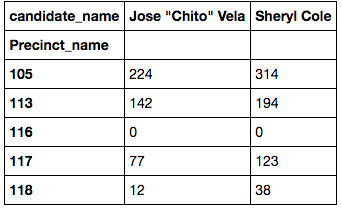
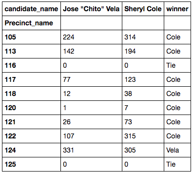

.apply: Apply a function a row or column
========================================

- [.apply](https://pandas.pydata.org/pandas-docs/stable/generated/pandas.DataFrame.apply.html) in pandas docs.

## Create a new column based on a function

Let's say you have a dataframe of election results:



That dataframe has an index of the precinct_name, so it looks a bit weird. The example dataframe is called `dsrd46_pivot`. (It was built from a [pivot](pivot.md).)

You want to assign a new column based on a function that computes the winner.

So, walking through the code below the outside in, we are:

- Creating a new dataframe called `dsrd46_winners`.
- That dataframe is created from `dsrd46_pivot` through the `.assign` method with a new column called `winner`.
- The values of the `winner` column are the result of the `.apply(get_winner)` method applied to rows using `axis=1`.


```python
def get_winner(row):
    """ Function to evaluate winners. """

    if row['Jose "Chito" Vela'] > row['Sheryl Cole']:
        return 'Vela'
    elif row['Jose "Chito" Vela'] < row['Sheryl Cole']:
        return 'Cole'
    elif row['Jose "Chito" Vela'] == row['Sheryl Cole']:
        return 'Tie'

# apply get_winner function to new column through .assign
dsrd46_winners = dsrd46_pivot.assign(
    winner=dsrd46_pivot.apply(
        get_winner,
        axis=1
        )
)

# peek at it
dsrd46_winners.head(10)
```

The result is:



Let's break it down:

- First, build a function that evaluates the values in a row. That's `def get_winner(row)` in our example. For each row, we use `if` or `elif` to evaluate the result for each candidate, then return a string for the name of the winner based on that. We have to do several evaluations to handle winners and ties.
- The part `dsrd46_pivot.apply(get_winner, axis=1)` applies the function to each row. A key here is `axis=1`, which says to apply our function to the rows in the dataframe, instead of the default `axis=0`, which is for columns.
- Then use that inside of a `.assign(column_name=value)` method to create a new column. Our new column name is `winner`, and our value is the the application of apply function.

## To do: An example using columns

I don't have an example yet.
