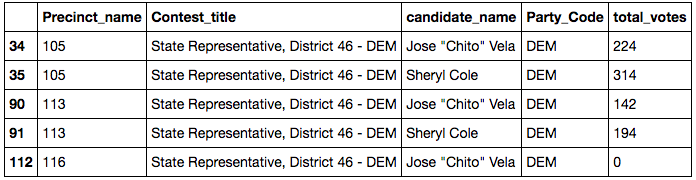
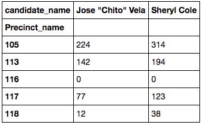

.pivot: Reshape data based on values in a column
================================================

## Reshape a dataframe based on values in a column

In this case, we are starting with some election results where each row is the results for a single candidate in a race.



We want a dataframe that has:

- one row for each precinct
- a column for each candidate
- total_votes for their values

To do this, we set which columns we want for index, columns and values.

``` python
# pivot to get candidate results
dsrd46_pivot = dsrd46.pivot(
    index='Precinct_name',
    columns='candidate_name',
    values='total_votes'
)

# peek
dsrd46_pivot.head()
```

The result is:



Questions to self:

- try more than one column
- sum or other aggregate values? Would that be groupby?


