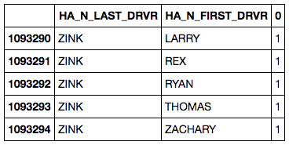
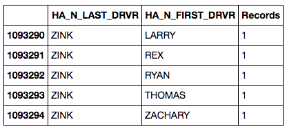

rename
======

## Renaming a count record in a dataframe.

I had a `groupby` function where I used `.size()` to count the number of records in each row. But the result leaves that dataframe column name as "0".

This is the group:

``` python
people = stops.groupby([
        'HA_N_LAST_DRVR',
        'HA_N_FIRST_DRVR',
        'HA_N_MIDDLE_DRVR']).size().reset_index()
```

And this is the result:



And then it's possible to rename the "size" column, as it is the 3rd one. (Remember counting starts at 0.)

``` python
people.rename(columns={people.columns[2]: "Records" })
```


